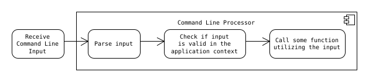

# Command Line Processor (clp)

## What is it?

Reading a command line from some source (a user-interface, a script file, ...) usually involves these next three steps

1. Parse input into logical pieces (commands and parameters, operands and operators, ...)
1. Check if the pieces satisfy application specific syntax rules and other constraints
1. Invoke an appropriate input handler that works on the parsed data.

The library aims to provide a convenient way to describe application-specific commands. These descriptions can be used to generate help-messages for the user. Internally the descriptions are used to determine whether an issued command line is valid or not. If it is valid, the corresponding input handler is invoked. Within the handler all parameters and options are safe to use in their intended ways, because types and value ranges have already been validated.

## Build

Requirements

- Compiler support for `C++11`
- `CMake` for the automated build process
    - version 3.10 or later
- `Boost Unit Test Framework` for the test executables
    - version 1.74 is used, but older version are likely to be sufficient as well

## Getting started

As soon as the library reaches a usable state, this part of the documentation will be addressed.

## Implementation details

Some information regarding the implementation can be found [here](docs/implementation.md)

