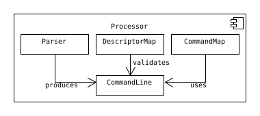
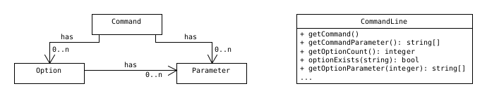

**Note:** This library is not (yet?) intended for use in a production environment. [Boost.Program_options](https://www.boost.org/doc/libs/1_80_0/doc/html/program_options.html) might be what you're looking for.

# Command Line Processor (clp)

A common task in many applications is to read some sort of instructions from an external source, like a script file or the command prompt in a shell.

The library's intent is to support the programmer by performing the necessary steps of *parsing* and *validating* the input, as well as *executing* an appropriate handler. This shall happen without putting restrictions onto the application programmer.

`Parser`, `DescriptorMap` and `CommandMap` have to be defined by the application (The library comes with a default parser, though). However, these three sub-components have one thing in common, the `CommandLine` class, that represents the logical structure of any instruction. In order to put this library to use, the following definition of a *command line* must be agreed on.

- A command line has exactly one element that is called the *command*.
- A command can have *options* and *parameters*.
- Each option can have parameters.

The definition can be further restricted by the application, but it can not be loosened up. The `NativeParser` (library's default parser) for example allows zero or exactly one parameter to be associated with an option. Any restriction, that does not break the `CommandLine` interface would be possible.

## Getting started

The library is not yet ready to be used. Therefore documentation on how to use it still has to be written. 

### Build requirements

- Compiler support for `C++11`
- `CMake` for the automated build process
    - version 3.10 or later
- `Boost Unit Test Framework` for the test executables
    - version 1.74 is used, but older version are likely to be sufficient as well

### Implementation details

Some information regarding the implementation is scrapped together every now and then.
It can be found [here](docs/implementation.md), but is likely to be inaccurate and/or out-of-date.

