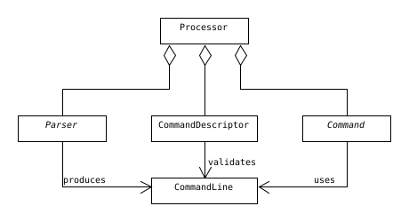

# Command Line Processor (clp)

The **Parser**'s responsibility is to convert a command line, that's been received from the application(e.g. `help me --i-am-lost`), into the library's data structure **CommandLine**.

Every **CommandDescriptor** gets to see the parsed *CommandLine*-object, and decides whether it matches its signature or not.

If the *CommandLine* is considered valid, the corresponding **Command** will be invoked, which can safely operate on the *CommandLine*.

