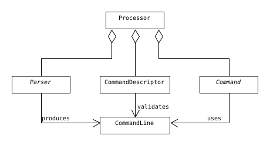
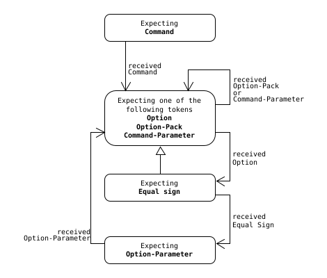

# Implementation details

[Back to overview](../README.md)

This file yields some information about the implementation. This information is incomplete and possibly out-of-date.

## Top level view

The **Parser**'s responsibility is to convert a command line, that's been received from the application(e.g. `help me --i-am-lost`), into the library's data structure **CommandLine**.

Every **CommandDescriptor** gets to see the parsed *CommandLine*-object, and decides whether it matches its signature or not.

If the *CommandLine* is considered valid, the corresponding **Command** will be invoked, which can safely operate on the *CommandLine*.



## Command Line

A command line is defined as follows.

- A command line consists of at least one element.
- Exactly one element is considered to be the command.
- Zero or more parameter can be associated with a command.
- A command can have zero or more options.
- An option can have zero or more parameters.


A concrete parser can put further restrictions on this definition, but cannot losen it up. The `NativeParser` described in the next section, for example, defines with its syntax rules, that an option can have either zero or exactly one parameter.


## Parser

The `NativeParser` is the concrete parser that comes with the library, and is deployed by default. The application programmer however can override this by providing an own parser implementation.

### `NativeParser` 



#### Command

The first word of a command line is interpreted as the command identifier. Unlike usual *identifiers* it may contain dashes, but must start with a letter or underscore.

Syntax examples:
```
count-words
_add_numbers
```

#### Parameter

A parameter can look like anything, but may not start with an equal sign.

Syntax examples:
```
count-words /path/to/file
_add_numbers 23 19
```

#### Option

An option must have two preceeding dashes (like `--option-name`). An option can accept exactly one parameter. An equal sign indicates the association. For example: `--diameter=15.5` (with or without spaces does not matter). If the equal sign is omitted, the parameter will be associated with the command.

Syntax examples:
```
count-words /path/to/file --word=TODO
```

#### Option-Pack

One or more 1-character long options (that don't accept parameters) can be packed together. For example `-abc` will set three different options (`a`,`b` and `c`).
Syntax examples:
```
tar -cvf
```